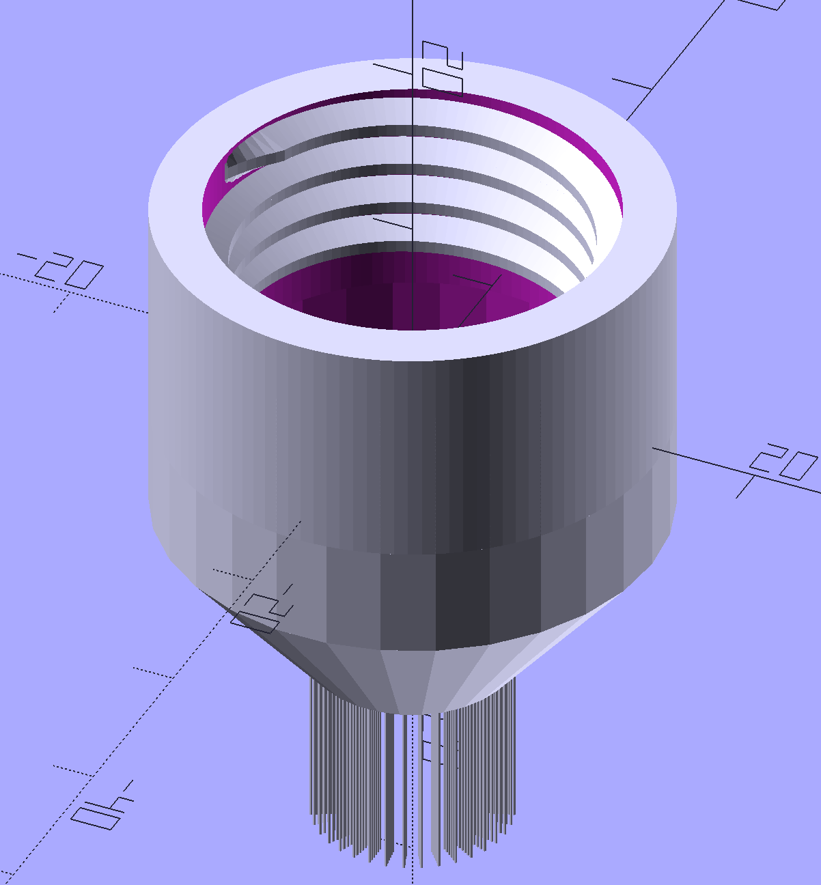

# High Pressure Water Tap

Building a water tap with a reduced surface area for higher pressure and integrated brushes.

## Install / Run

1. Install Openscad
2. Add [threadlib](https://github.com/adrianschlatter/threadlib) and all corresponding dependencies to Openscad library

To add libraries to Openscad

1. Download required repository
2. Find local library folder: [File] -> [Add libraries]
3. Move repository to library folder
